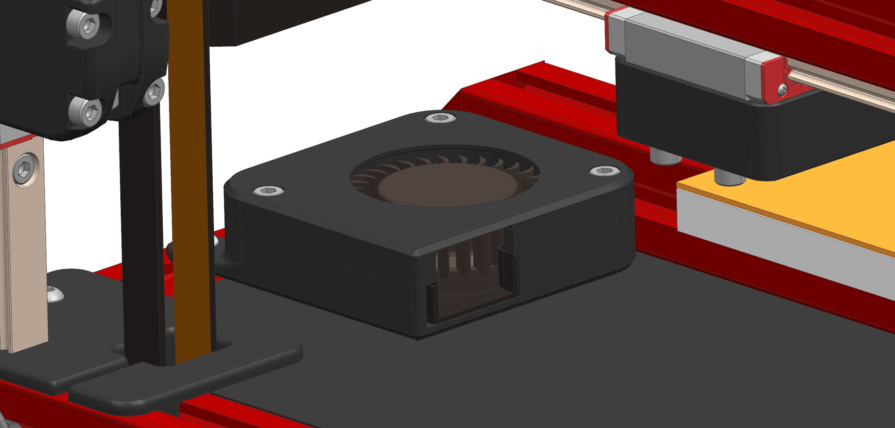
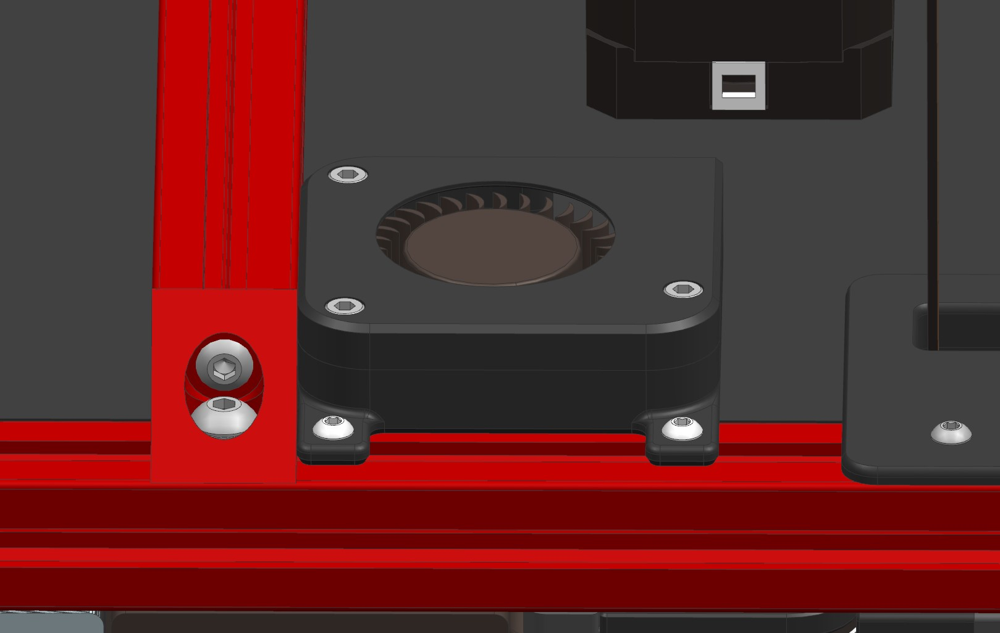
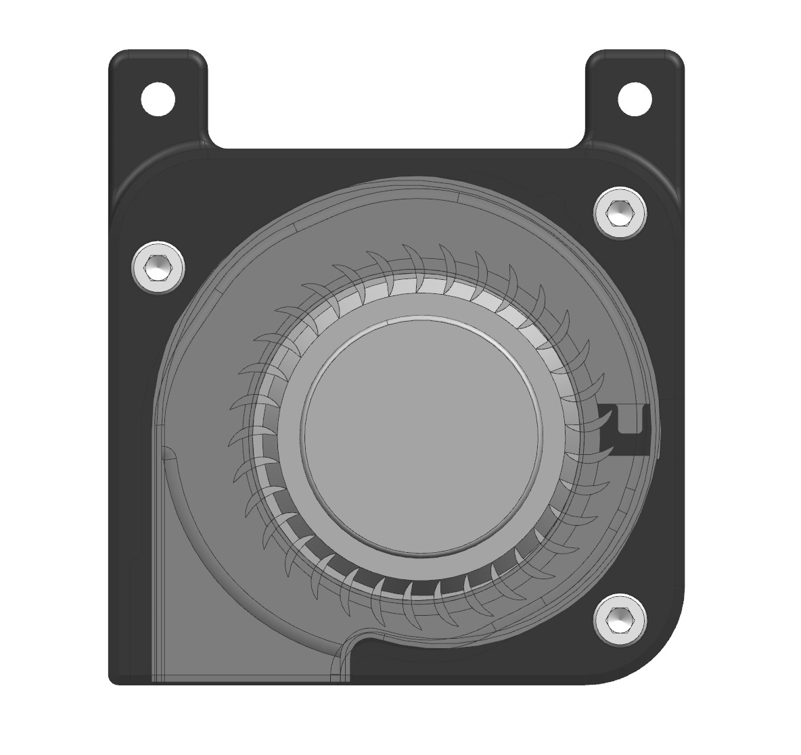
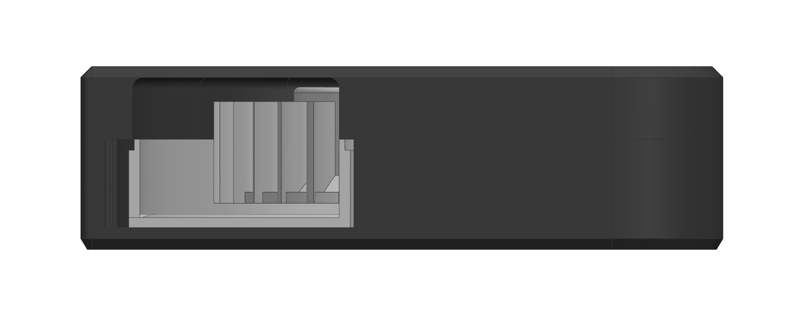
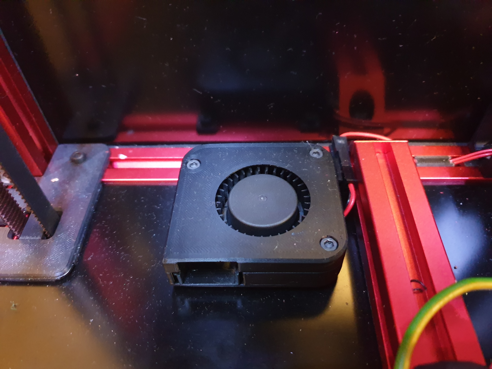
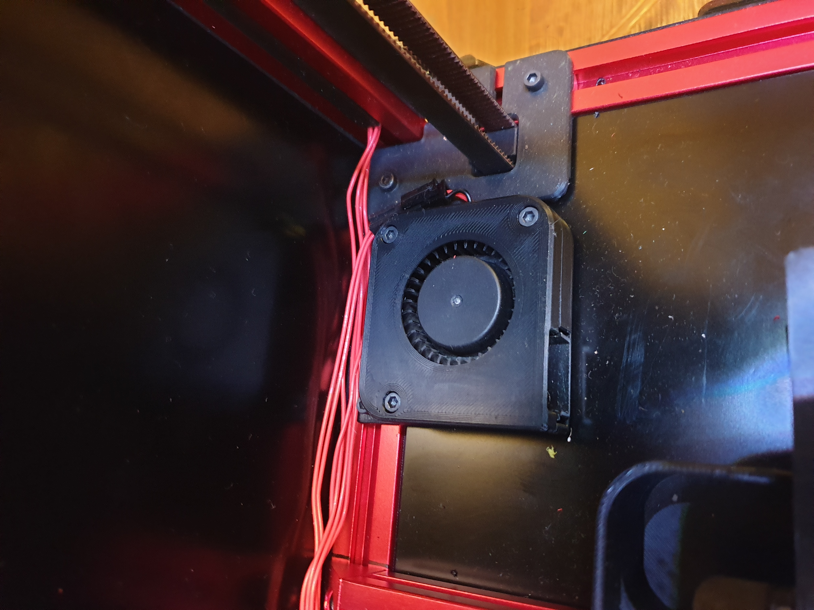

# Chamber blower housing

Chamber blowers for a quicker heat-up and slightly increased chamber temperatures. To use it, you have to snap off the top part of the blower housing. Unfortunately, to use them you have to mutilate your 5015 blower, and cut off screw ears. In my case I didn't really care, as I don't plan to reuse those fans for any different purpose. In my setup, I have 2 additional blowers mounted behind the bed plate, but it's up to you and your imagination where you'd prefer to screw them.

You could probably just use vanilla 5015 blowers screwed to some kind of a simple base, but external housing feels more aesthetic.

