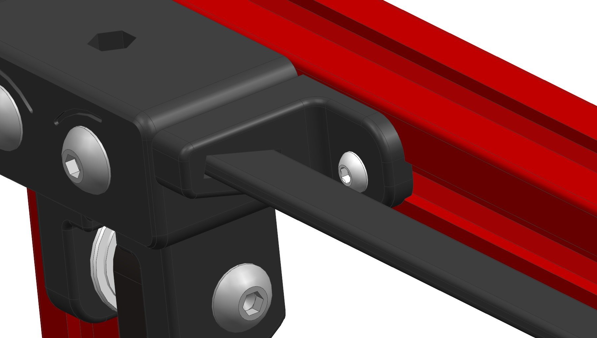

# LED strip mount

A mount which can be use with any easily accessible LED strips. It consists of 2 mounts which fix a flexible printed spine. The LED strip is glued to the spine by a double-sided tape. Apply a pressure between two mounts before screwing, to bow the spine.

This particular design is for V2.4 300mm^3

