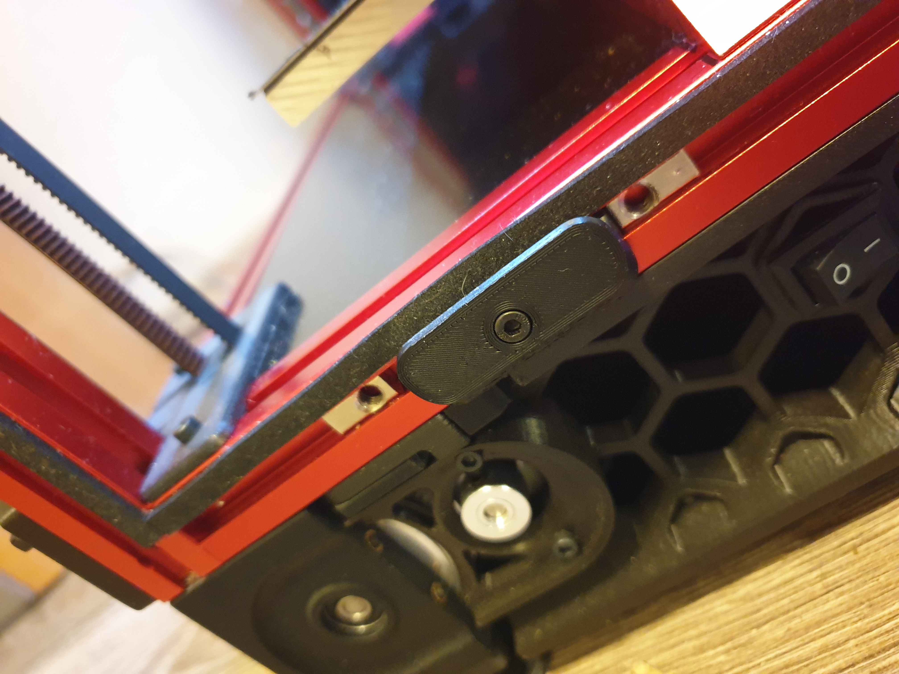

# Panel supports 

A heavily modified V2.2 front handle. Designed to look nicer and less visually offensive.

It is designed for 4mm thick panels, with 2mm foam gasket. To be fixed by roll-in M3 nuts. There is a single-layer bridge integrated in the screw hole, which has to be popped with a screw or some kind of pin.

