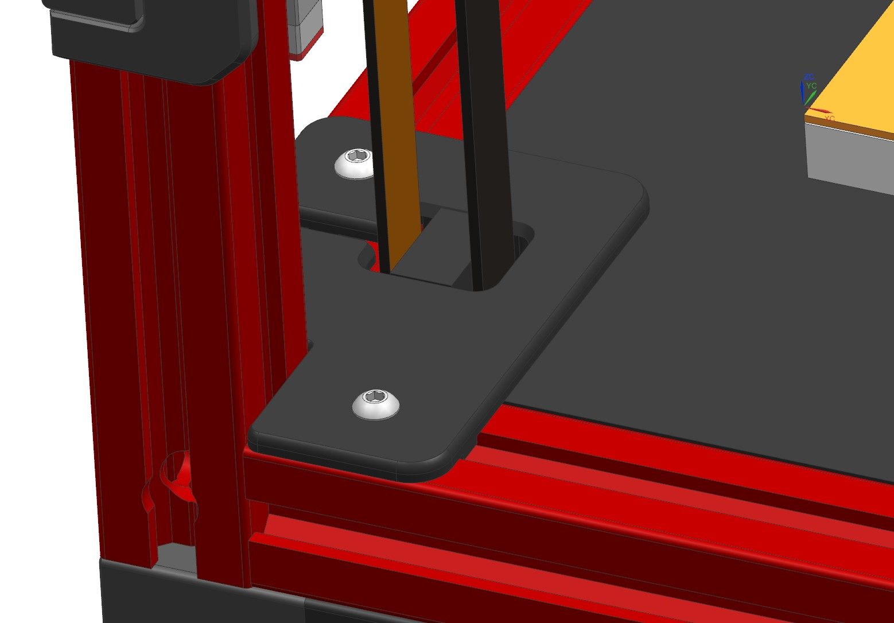
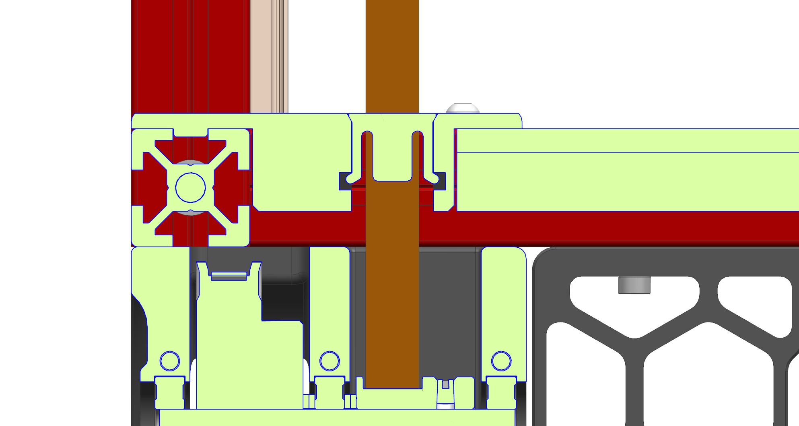
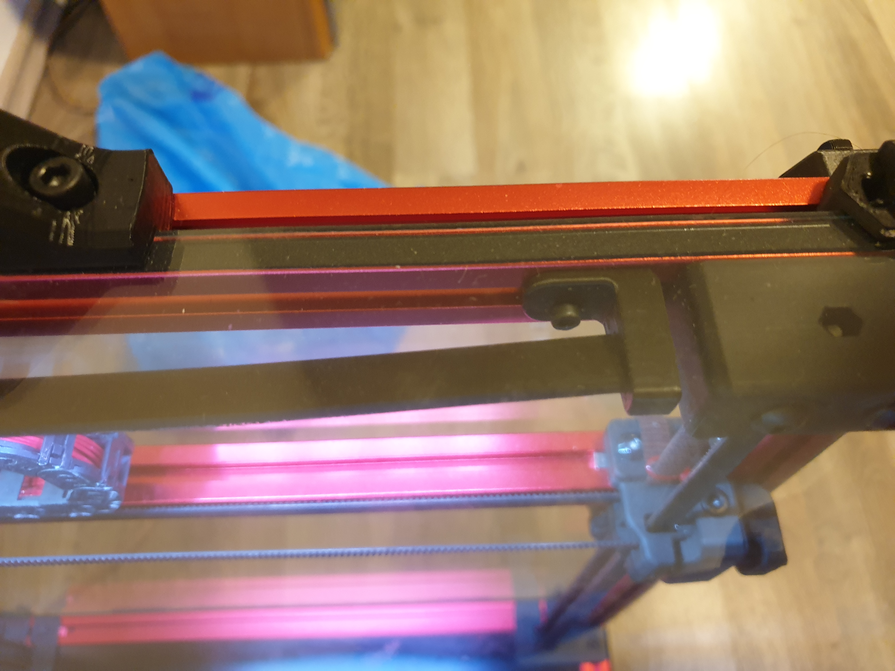
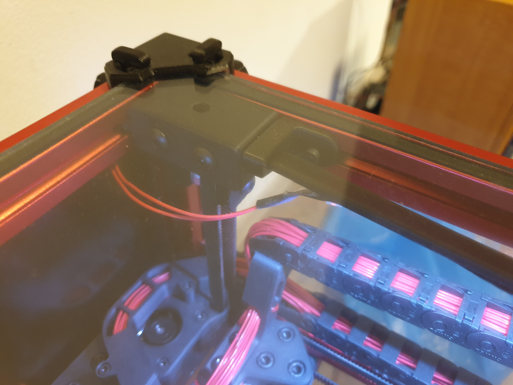
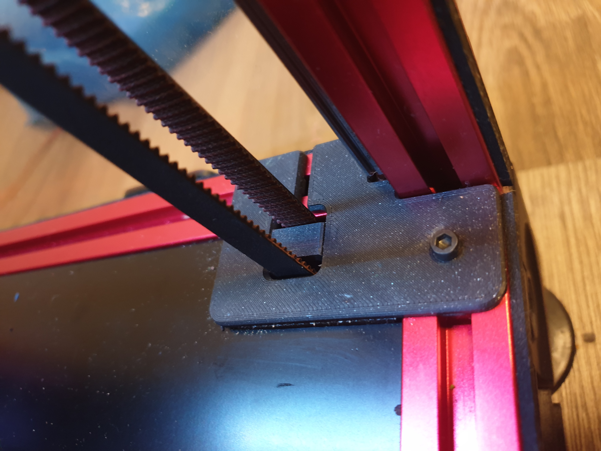
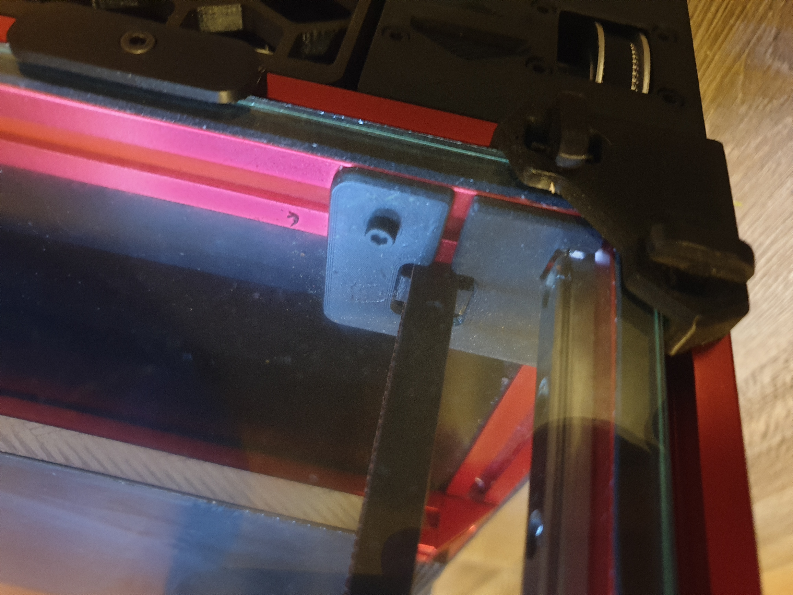

# Z belt covers

Modified covers for Z belt with additional fixing screw, rail cutout for easier assembly, deleted pressfit in the extrusion groove and clip for minimization of belt window. It does not seal the gap, but at least decreases the cross section through which the heated air can escape. The clip snaps in with a crisp click and belts are not rubbing on anything (at least on my printer). I have additionally used a 10mm thick layer of cork beneath the deck panel, but these covers can be used in a vanilla setup.

